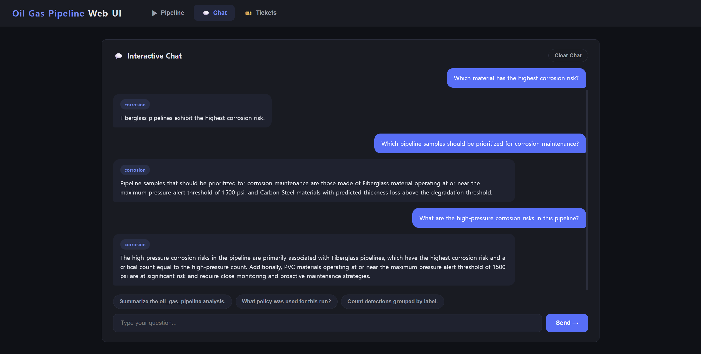
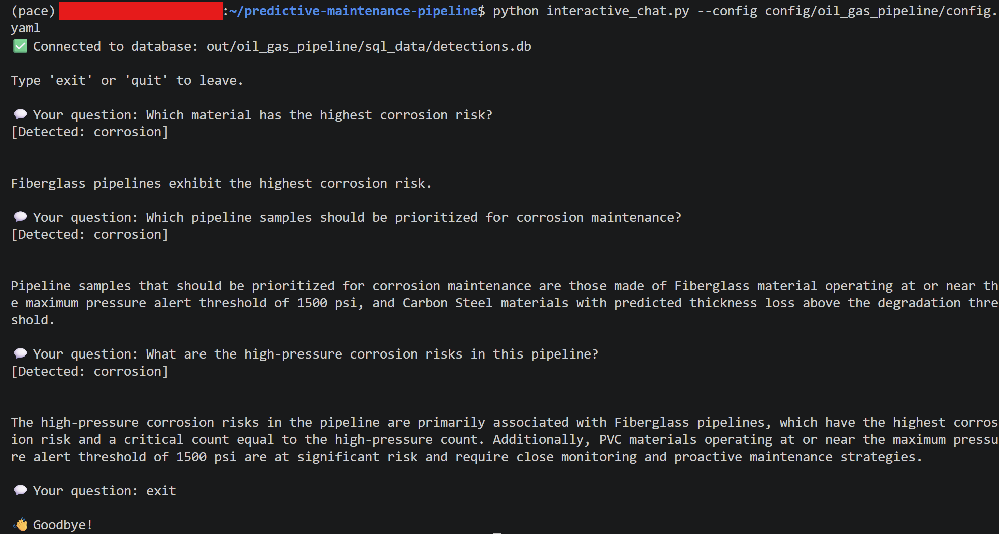

# Oil and Gas Pipeline Use Case

> **Oil and Gas Pipeline Predictive Maintenance Use Case**
> Tabular Sensor Inference + Degradation Risk Filtering + Agent-Based Analysis

This document describes the **Oil and Gas Pipeline** predictive maintenance use
case. The use case extends the pipeline from image and multimodal inspection into
**tabular sensor data**. It uses an OpenVINO MLP model to predict pipeline
condition and thickness loss, stores the results in SQLite, and routes the outputs
through the existing policy, analysis, evidence, and corrosion-specialist agent
flow.


## Use Case Overview

Oil and gas pipelines degrade over time because of corrosion, pressure, material
properties, temperature, and operating age. Instead of detecting visual defects from
images, this use case uses tabular sensor and metadata values to estimate pipeline
health.

The model produces two main outputs:

- **Condition class:** `Normal`, `Moderate`, or `Critical`
- **Predicted thickness loss:** stored as `continuous_value`
- **Degradation score:** probability of the `Critical` condition

The generated results are written to JSONL and SQLite, then used by the agent layer
to produce analysis, evidence, and corrosion-risk summaries.


## Dataset

The use case is based on the **Predictive Maintenance Oil and Gas Pipeline** dataset
from Kaggle. The dataset contains CSV-based tabular records for pipeline samples.

- **Dataset source:** [Predictive Maintenance Oil and Gas Pipeline](https://www.kaggle.com/datasets/muhammadwaqas023/predictive-maintenance-oil-and-gas-pipeline-data)
- **License:** MIT

- **Dataset type:** Tabular sensor data
- **Number of samples:** 1,000 rows
- **Number of original columns:** 11
- **Input modality:** Sensor / tabular data
- **Prediction targets:** thickness loss and condition

Example input columns include:

| Column | Description |
|--------|-------------|
| `Pipe_Size_mm` | Pipe size in millimeters |
| `Thickness_mm` | Original pipe thickness |
| `Material` | Pipe material type |
| `Grade` | Pipe material grade |
| `Max_Pressure_psi` | Maximum operating pressure |
| `Temperature_C` | Operating temperature |
| `Corrosion_Impact_Percent` | Corrosion impact estimate |
| `Material_Loss_Percent` | Material loss percentage |
| `Time_Years` | Operating time in years |
| `Thickness_Loss_mm` | Ground-truth thickness loss |
| `Condition` | Ground-truth condition label |

The model input has 17 features because the numeric columns are combined with
one-hot encoded categorical features for `Material` and `Grade`.


## Model

The use case uses a small **multi-layer perceptron (MLP)** model converted to
OpenVINO IR format.

- **Model path:** `models/ov_models/oil_gas_pipeline/sensor_mlp/sensor_mlp_og.xml`
- **Input:** `sensor_input [?, 17]`
- **Outputs:**
  - `thickness_loss_pred [?, 1]`
  - `condition_logits [?, 3]`
- **Classes:** `Normal`, `Moderate`, `Critical`
- **Runtime:** OpenVINO

The model performs two tasks from the same feature vector:

1. Regression: predict thickness loss
2. Classification: predict the pipeline condition class


## Pipeline Flow

The Oil and Gas Pipeline use case follows the same high-level pipeline structure as
the existing use cases:

1. Read the use-case config from `config/oil_gas_pipeline/config.yaml`
2. Dispatch inference to `SensorFlatHandler`
3. Load the CSV sensor samples and scaler metadata
4. Run OpenVINO MLP inference
5. Write prediction results to JSONL and SQLite
6. Run the agent orchestration pipeline
7. Generate analysis, evidence, and corrosion-specialist outputs
8. Query the results from the unified Web UI chat interface


## Key Features

This use case adds support for tabular sensor output with both a predicted
condition label and a predicted thickness-loss value.

Important schema fields include:

| Field | Description |
|-------|-------------|
| `label` | Predicted condition label |
| `confidence` | Confidence of the predicted class |
| `degradation_score` | Probability of the `Critical` condition |
| `continuous_value` | Predicted thickness loss |
| `material_type` | Pipe material |
| `max_pressure` | Maximum operating pressure |
| `time_years` | Operating time in years |

The policy layer uses a degradation threshold to decide which rows should be
treated as high-degradation pipeline samples:

```json
{
  "policy_type": "regression",
  "degradation_threshold": 5.0,
  "pressure_alert_threshold": 1500.0,
  "corrosion_alert_level": "high"
}
```

Rows are flagged when `continuous_value` is greater than `degradation_threshold`.
The threshold is set to `5.0` because the dataset distribution shows that
`Moderate` samples go up to about 5.00 mm thickness loss, while `Critical`
samples start from about 5.01 mm.

The `pressure_alert_threshold` is set to `1500.0` because the pressure values are
grouped into lower-pressure values (`150` and `300` psi) and high-pressure values
(`1500` and `2500` psi).


## Agent Outputs

The use case uses the configurable agent graph in the pipeline.

Active agents:

- `policy`
- `analysis`
- `evidence`
- `corrosion`

The `policy_agent` loads or generates the filtering policy, including the
degradation threshold, pressure alert threshold, and class confidence thresholds.

The `analysis_agent` summarizes general result statistics such as condition
distribution, predicted thickness loss, high-degradation count, and material-level
degradation patterns.

The `evidence_agent` records policy decisions and traceability information,
including how many samples were kept after filtering.

The `corrosion_agent` is a specialist agent for the Oil and Gas Pipeline use case.
It avoids repeating the general analysis summary and focuses on:

- high-risk materials
- high-pressure pipeline cases
- samples above the degradation threshold
- maintenance priority


## Results

The pipeline was verified on 1,000 sensor samples.

Example validation results:

| Metric | Result |
|--------|--------|
| Samples processed | 1,000 |
| Condition accuracy | 87.1% |
| Thickness loss MAE | 0.559 |
| Thickness loss RMSE | 0.716 |

The pipeline successfully generated:

- `out/oil_gas_pipeline/detections.jsonl`
- `out/oil_gas_pipeline/sql_data/detections.db`
- `out/oil_gas_pipeline/agent/policy.json`
- `out/oil_gas_pipeline/agent/analysis_summary.txt`
- `out/oil_gas_pipeline/agent/evidence_trail.txt`
- `out/oil_gas_pipeline/agent/corrosion_summary.txt`


## Running the Use Case

Run inference:

```bash
python run_inference_oep.py --config config/oil_gas_pipeline/config.yaml
```

Run agent orchestration:

```bash
python scripts/run_agent_orchestration.py --use-case oil_gas_pipeline
```

Run related tests:

```bash
python -m pytest tests/test_oil_gas_chat_routing.py tests/test_oil_gas_agent_outputs.py -v
```


## Web UI

The Oil and Gas Pipeline use case is available in the Web UI use-case selector.
The chat interface can automatically route corrosion-related questions to the
corrosion mode.

Example questions:

- Which material has the highest corrosion risk?
- Which pipeline samples should be prioritized for corrosion maintenance?
- What are the high-pressure corrosion risks in this pipeline?

Example response:

```text
[Detected: corrosion]
Fiberglass pipelines exhibit the highest corrosion risk.
```


## Screenshots

Web UI corrosion chat:



CLI corrosion chat:




## Summary

The Oil and Gas Pipeline use case demonstrates how the pipeline can support
tabular sensor data with both a condition classification output and a thickness-loss
prediction output. It reuses the dispatcher and handler structure, extends the
SQLite schema for degradation-specific fields, and adds a corrosion-specialist
agent for domain-specific maintenance reasoning.
