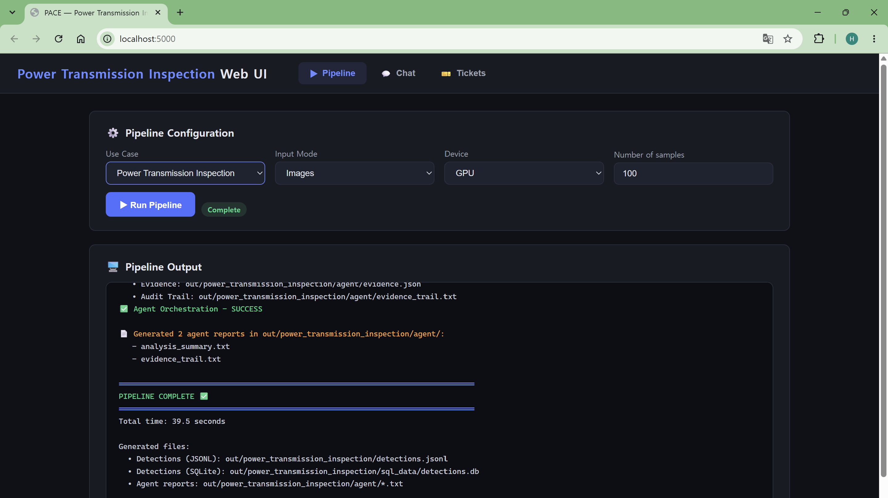
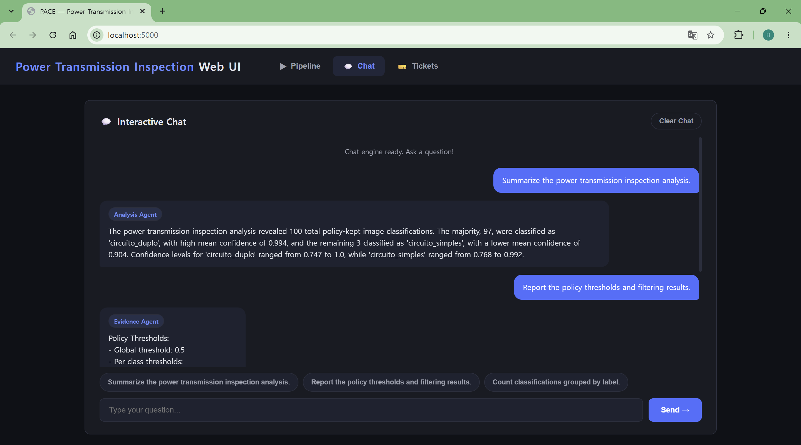

# Power Transmission Inspection Use Case

> **Power Transmission Circuit Image Classification**
> RGB Image Inference + Confidence Policy Filtering + Agent-Based Analysis

This document describes the **Power Transmission Inspection** predictive
maintenance use case. It classifies RGB power-transmission images into three
circuit categories with an OpenVINO classification model, stores the results in
JSONL and SQLite, and routes the outputs through the standard policy, analysis,
and evidence agents.


## Use Case Overview

The use case identifies the transmission-circuit configuration shown in each
input image. Every image produces one classification containing:

- source image filename
- predicted circuit class and class identifier
- classification confidence

The results can be reviewed through generated agent reports or queried through
the CLI and Web UI chat interfaces.


## Dataset

The local test dataset contains RGB images representing real and synthetic
power-transmission circuit scenes.

- **Dataset directory:** `datasets/power_transmission_inspection`
- **Input modality:** RGB image
- **Image channels:** 3
- **Test images:** 348
- **Classes:** 3
- **Images per ground-truth class:** 116

The filename prefix provides the ground-truth class used for evaluation:

| ID | Class | Description |
|---:|-------|-------------|
| 0 | `circuito_duplo` | Synthetic double-circuit transmission scene |
| 1 | `circuito_real` | Real-world transmission scene |
| 2 | `circuito_simples` | Synthetic single-circuit transmission scene |

The complete source dataset contains a 2:1 synthetic-to-real ratio. This
integration uses only its held-out test images: 232 synthetic images and 116
real-world images.


## Model

The supplied model is an Ultralytics YOLOv8s classification model exported to
OpenVINO IR format.

- **Model XML:** `models/ov_models/power_transmission_inspection/best.xml`
- **Model weights:** `models/ov_models/power_transmission_inspection/best.bin`
- **Metadata:** `models/ov_models/power_transmission_inspection/metadata.yaml`
- **Task:** Image classification
- **Runtime:** OpenVINO
- **Device:** Intel integrated GPU
- **Input:** `[1, 3, 640, 640]`, FP32
- **Output:** `[1, 3]`, one score for each class

The existing `OpenVINOClassifyHandler` resizes and normalizes every RGB image,
runs OpenVINO inference, converts the model output to class probabilities when
needed, and returns the highest-scoring class.


## Pipeline Flow

The Power Transmission Inspection use case follows the shared PACE pipeline:

1. Read `config/power_transmission_inspection/config.yaml`
2. Dispatch inference to `OpenVINOClassifyHandler`
3. Load and preprocess RGB images at `640 x 640`
4. Run OpenVINO classification on the configured device
5. Select the highest-confidence class for each image
6. Write classification results to JSONL and SQLite
7. Apply the confidence policy
8. Generate analysis and evidence reports
9. Query the results through the CLI or Web UI chat interface


## Configuration

The essential inference configuration is:

```yaml
modality: image
nc: 3
names:
  0: circuito_duplo
  1: circuito_real
  2: circuito_simples

inference:
  handler: openvino_classify
  task: classify
  model_path: models/ov_models/power_transmission_inspection/best.xml
  device: GPU
  imgsz: 640
  input_mode: images
  images_path: datasets/power_transmission_inspection
```

The standard agents are enabled:

```yaml
agents:
  active: [policy, analysis, evidence]
  confidence_threshold: 0.5
```


## SQLite Schema

Each row represents one classified image.

| Field | Description |
|-------|-------------|
| `id` | SQLite primary key |
| `image_id` | Sequential image identifier |
| `source` | Source RGB image filename |
| `label` | Predicted circuit class |
| `confidence` | Classification confidence |
| `created_at` | Database insertion timestamp |


## Agent Outputs

The active agents are:

- `policy`
- `analysis`
- `evidence`

The policy applies a global confidence threshold of `0.5` and the same
per-class threshold to `circuito_duplo`, `circuito_real`, and
`circuito_simples`. In the complete 348-image test run, every prediction passed
this policy.

The analysis report contains:

- total policy-kept image classifications
- class distribution
- per-class count, mean confidence, minimum confidence, and maximum confidence

The evidence report records:

- global and per-class confidence thresholds
- raw, policy-kept, and filtered classification totals
- policy-kept counts by class


## Test-Set Evaluation

The model was evaluated on all 348 held-out test images. Ground-truth labels
were obtained from the image filename prefixes.

| Metric | Result |
|--------|-------:|
| Images | 348 |
| Correct classifications | 334 |
| Incorrect classifications | 14 |
| Accuracy | 0.9598 |
| Mean prediction confidence | 0.9788 |

Per-class results:

| Class | Precision | Recall | F1 |
|-------|----------:|-------:|---:|
| `circuito_duplo` | 0.9180 | 0.9655 | 0.9412 |
| `circuito_real` | 1.0000 | 1.0000 | 1.0000 |
| `circuito_simples` | 0.9636 | 0.9138 | 0.9381 |

Confusion counts:

| Ground truth | `circuito_duplo` | `circuito_real` | `circuito_simples` |
|--------------|------------------:|-----------------:|--------------------:|
| `circuito_duplo` | 112 | 0 | 4 |
| `circuito_real` | 0 | 116 | 0 |
| `circuito_simples` | 10 | 0 | 106 |

All 14 errors occurred between the two synthetic circuit classes. The
`circuito_real` class was classified correctly for all 116 test images.


## Performance

The complete test-set inference used OpenVINO on the Intel integrated GPU.
The measurement includes image loading, preprocessing, model inference,
postprocessing, and output writing.

| Performance metric | Result |
|--------------------|-------:|
| Images | 348 |
| Elapsed time | 4.89 s |
| Throughput | Approximately 71.2 images/s |
| Maximum process memory | 407,616 KB |


## Output Artifacts

The use case generates:

```text
out/power_transmission_inspection/detections.jsonl
out/power_transmission_inspection/sql_data/detections.db
out/power_transmission_inspection/agent/policy.json
out/power_transmission_inspection/agent/analysis_report.json
out/power_transmission_inspection/agent/analysis_summary.txt
out/power_transmission_inspection/agent/evidence.json
out/power_transmission_inspection/agent/evidence_trail.txt
```


## Running the Use Case

Run inference:

```bash
python run_inference_oep.py \
  --config config/power_transmission_inspection/config.yaml \
  --device GPU
```

Run agent orchestration:

```bash
python -m scripts.run_agent_orchestration \
  --use-case power_transmission_inspection
```

Run the CLI chat interface:

```bash
python interactive_chat.py \
  --config config/power_transmission_inspection/config.yaml
```

Start the Web UI:

```bash
python scripts/launch_web_app.py start
```


## Web UI Pipeline and Chat Verification

The Web UI completed inference and agent orchestration for 100 test images.




The Web UI routed the predefined questions to the Analysis and Evidence agents.




## Summary

The Power Transmission Inspection use case adds RGB power-transmission image
classification to the PACE pipeline using the existing OpenVINO classification
handler. It integrates a three-class OpenVINO model with JSONL and SQLite
outputs, confidence-based policy filtering, analysis and evidence reports, and
the unified CLI and Web UI chat workflows. The model achieved `95.98%` accuracy
on the balanced 348-image test set.
