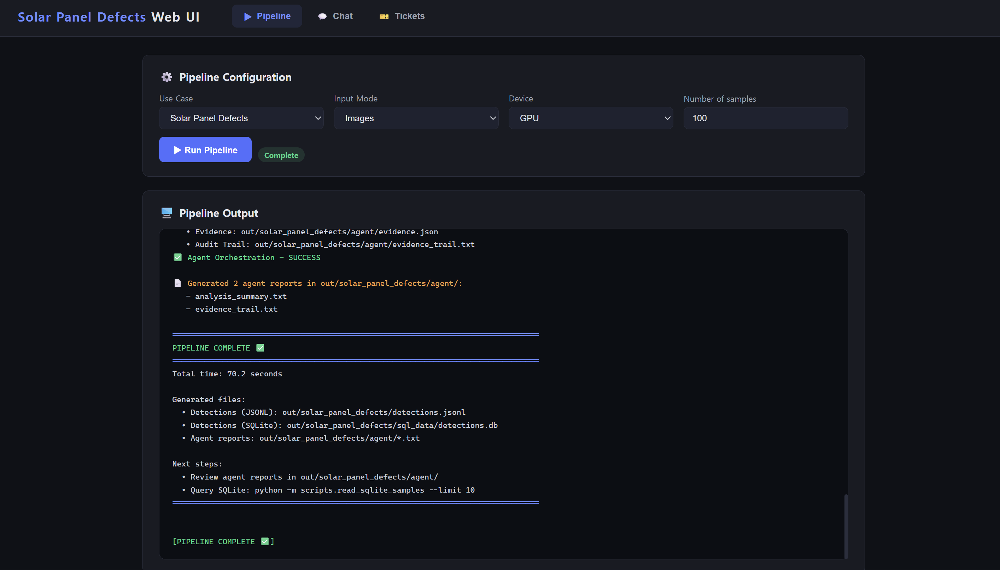
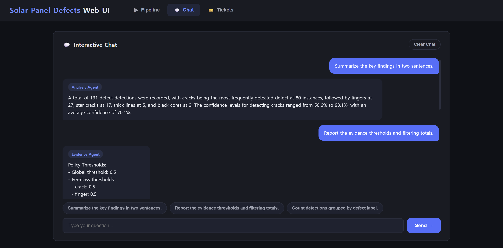

# Solar Panel Defects Use Case

> **PVEL-AD Solar Cell Defect Detection**
> Single-Channel Electroluminescence Image Inference + Bounding-Box Detection +
> Agent-Based Analysis

This document describes the **Solar Panel Defects** predictive maintenance use
case. The use case detects defects in single-channel electroluminescence images
from the PVEL-AD dataset. It runs a fine-tuned YOLO-style model with OpenVINO,
applies confidence filtering and class-aware non-maximum suppression (NMS), stores the
resulting bounding boxes in JSONL and SQLite, and routes the outputs through the
existing policy, analysis, and evidence agent flow.


## Use Case Overview

Electroluminescence imaging reveals cracks and other defects that may not be
visible in ordinary RGB photographs of solar cells. This use case processes each
electroluminescence image as a single-channel input and returns zero or more
defect bounding boxes.

The pipeline produces the following information for every retained detection:

- source image filename
- predicted defect class and class identifier
- detection confidence
- bounding-box coordinates in the original image coordinate system
- modality source (`electroluminescence`)

The generated results are written to JSONL and SQLite. The agent layer then
applies a confidence policy and produces analysis and evidence reports. The same
outputs can be queried through the CLI and Web UI chat interfaces.


## Dataset

The use case is based on the open-access
[PVEL-AD dataset](https://github.com/binyisu/PVEL-AD), which contains annotated
electroluminescence images of solar cells.

- **Dataset type:** Solar-cell defect images
- **Input modality:** Image
- **Modality source:** Electroluminescence
- **Image channels:** 1 (grayscale)
- **Annotation format:** Pascal VOC XML
- **Train/validation images:** 4,500
- **Test images:** 19,150
- **Test annotations:** 19,150
- **Test ground-truth objects:** 34,116

This integration uses the PVEL-AD test split for inference and evaluation:

```text
datasets/solar_panel_defects/test/JPEGImages
datasets/solar_panel_defects/test/Annotations
```

The model supports 12 defect classes:

| ID | Class |
|---:|-------|
| 0 | `crack` |
| 1 | `finger` |
| 2 | `thick_line` |
| 3 | `star_crack` |
| 4 | `short_circuit` |
| 5 | `black_core` |
| 6 | `horizontal_dislocation` |
| 7 | `fragment` |
| 8 | `corner` |
| 9 | `vertical_dislocation` |
| 10 | `scratch` |
| 11 | `printing_error` |


## Model

The use case uses a model that was pretrained and fine-tuned on PVEL-AD, then
exported to OpenVINO IR format.

- **Model XML:** `models/ov_models/solar_panel_defects/best.xml`
- **Model weights:** `models/ov_models/solar_panel_defects/best.bin`
- **Metadata:** `models/ov_models/solar_panel_defects/metadata.yaml`
- **Task:** Object detection
- **Runtime:** OpenVINO
- **Device:** Intel integrated GPU
- **Inference precision:** FP32
- **Input:** `[1, 1, 640, 640]`
- **Output:** `[1, 16, 8400]`

The output dimensions represent:

- `16`: four bounding-box coordinates plus 12 class scores
- `8400`: YOLO candidate boxes


## OpenVINO Detection Handler

The `OpenVINODetectHandler` implements direct OpenVINO inference for YOLO-style
object-detection output. The handler is selected with:

```yaml
inference:
  handler: openvino_detect
  task: detect
```

Its processing flow is:

1. Read the image as grayscale when the model input has one channel
2. Resize and letterbox-pad the image to `640 x 640`
3. Normalize pixel values to the `[0, 1]` range
4. Run OpenVINO inference on the configured device
5. Decode the `[1, 16, 8400]` YOLO-style output
6. Apply the detector confidence threshold
7. Apply class-aware non-maximum suppression
8. Restore bounding boxes to the original image coordinates
9. Return detection objects for JSONL and SQLite output

Example frame output:

```json
{
  "source": "img003707.jpg",
  "objects": [
    {
      "source": "img003707.jpg",
      "modality_source": "electroluminescence",
      "detection": {
        "label": "star_crack",
        "confidence": 0.759939968585968,
        "label_id": 3,
        "bounding_box": {
          "x_min": 842.4196166992188,
          "y_min": 264.99591064453125,
          "x_max": 924.8909301757812,
          "y_max": 339.7412109375
        }
      }
    }
  ]
}
```


## Pipeline Flow

The Solar Panel Defects use case follows the shared PACE pipeline:

1. Read `config/solar_panel_defects/config.yaml`
2. Dispatch inference to `OpenVINODetectHandler`
3. Load PVEL-AD electroluminescence images
4. Run OpenVINO FP32 inference on the Intel integrated GPU
5. Decode detections and apply confidence filtering and class-aware NMS
6. Restore bounding boxes to the original image coordinates
7. Write inference results to JSONL and SQLite
8. Run the policy, analysis, and evidence agents
9. Query the results through the CLI or Web UI chat interface

The Web UI runs the 100-image inference and agent orchestration flow and shows
the generated JSONL, SQLite, analysis, and evidence artifacts:




## Configuration and Thresholds

The detector and policy use different confidence thresholds:

| Stage | Threshold | Purpose |
|-------|----------:|---------|
| Detector | 0.25 | Retain raw model detections after inference |
| NMS | IoU 0.45 | Suppress overlapping boxes within the same class |
| Agent policy | 0.50 | Retain detections for analysis and evidence reports |

The standard serving configuration processes 100 test images. This keeps the
end-to-end inference and agent workflow short enough for demonstrations while the
full test-set results remain stored separately for evaluation.


## SQLite Schema

Each SQLite row represents one detected defect bounding box, not one image.
Therefore, a source image can produce multiple rows or no rows.

| Field | Description |
|-------|-------------|
| `image_id` | Sequential image identifier |
| `source` | Source electroluminescence image filename |
| `label` | Predicted defect class |
| `confidence` | Detection confidence score |
| `bbox_xmin` | Left bounding-box coordinate in original-image pixels |
| `bbox_ymin` | Top bounding-box coordinate in original-image pixels |
| `bbox_xmax` | Right bounding-box coordinate in original-image pixels |
| `bbox_ymax` | Bottom bounding-box coordinate in original-image pixels |
| `modality_source` | Image modality (`electroluminescence`) |
| `created_at` | Database insertion timestamp |


## Agent Outputs

The active agents are:

- `policy`
- `analysis`
- `evidence`

The `policy_agent` applies a global confidence threshold of `0.5` and the same
threshold to every supported defect class.

The `analysis_agent` summarizes:

- total policy-kept bounding-box detections
- defect classes ranked by detection count
- per-class confidence statistics

The `evidence_agent` records:

- global and per-class confidence thresholds
- raw, policy-kept, and filtered detection totals
- policy-kept detection counts by class

For the standard 100-image run, the pipeline produced:

| Result | Count |
|--------|------:|
| Images processed | 100 |
| Raw detections at confidence 0.25 | 217 |
| Policy-kept detections at confidence 0.5 | 131 |
| Policy-filtered detections | 86 |

The terms `images`, `raw detections`, and `policy-kept detections` refer to
different quantities and must not be used interchangeably.


## Full Test-Set Evaluation

The detector was evaluated once on all 19,150 PVEL-AD test images. Predictions
were matched to Pascal VOC ground-truth boxes using class-aware greedy one-to-one
matching at an IoU threshold of `0.5`.

| Metric | Result |
|--------|-------:|
| Images | 19,150 |
| Missing annotations | 0 |
| Ground-truth objects | 34,116 |
| Predicted objects | 30,362 |
| True positives | 26,685 |
| False positives | 3,677 |
| False negatives | 7,431 |
| Precision | 0.8789 |
| Recall | 0.7822 |
| F1 | 0.8277 |

These values are detection precision, recall, and F1 at IoU `0.5`; they are not
mAP metrics.

The complete inference run used OpenVINO FP32 on the Intel integrated GPU:

| Performance metric | Result |
|--------------------|-------:|
| Elapsed time | 12 min 48.15 s |
| Throughput | Approximately 24.9 images/s |
| Maximum process memory | 389,032 KB |

The full-run artifacts are preserved separately under:

```text
out/solar_panel_defects_full_19150/
```


## Output Artifacts

The standard run generates:

```text
out/solar_panel_defects/detections.jsonl
out/solar_panel_defects/sql_data/detections.db
out/solar_panel_defects/agent/policy.json
out/solar_panel_defects/agent/analysis_report.json
out/solar_panel_defects/agent/analysis_summary.txt
out/solar_panel_defects/agent/evidence.json
out/solar_panel_defects/agent/evidence_trail.txt
```


## Running the Use Case

Run inference with the configured defaults of 100 images and GPU execution:

```bash
python run_inference_oep.py \
  --config config/solar_panel_defects/config.yaml
```

Run agent orchestration:

```bash
python -m scripts.run_agent_orchestration \
  --use-case solar_panel_defects
```

Run the CLI chat interface:

```bash
python interactive_chat.py \
  --config config/solar_panel_defects/config.yaml
```

Start the Web UI:

```bash
python scripts/launch_web_app.py start
```


## Evaluation and Tests

Evaluate a JSONL prediction file against the Pascal VOC annotations:

```bash
python scripts/evaluate_solar_results.py \
  --predictions out/solar_panel_defects/detections.jsonl \
  --annotations datasets/solar_panel_defects/test/Annotations \
  --iou-threshold 0.5
```

Run the OpenVINO detection handler tests:

```bash
python -m pytest tests/test_openvino_detect.py -v
```

The handler tests cover:

- transposed YOLO output decoding
- confidence filtering and class-aware NMS
- detection-object to SQLite-schema mapping
- rejection of output shapes that do not match the configured class count


## Chat Verification

The chat system was verified in both the CLI and Web UI. It supports three
Solar-specific query modes.

Analysis example:

```text
Briefly summarize the key analysis findings.
```

Evidence example:

```text
Report the evidence thresholds and filtering totals.
```

SQL example:

```text
Count detections grouped by defect label.
```

The SQL mode queries the raw SQLite detections. Analysis and evidence operate on
the policy-filtered agent results, so their totals can differ as expected.

The Web UI displays the routed Analysis and Evidence Agent responses and provides
predefined Solar-specific questions for each query mode:




## Summary

The Solar Panel Defects use case adds single-channel electroluminescence object
detection to the PACE pipeline. It introduces a reusable OpenVINO handler for
YOLO-style detection output, preserves original-image bounding-box coordinates,
stores results in the shared JSONL and SQLite formats, and integrates the results
with the standard policy, analysis, evidence, CLI, and Web UI workflows. The
implementation was validated with unit tests, a 100-image serving run, and a
full evaluation over 19,150 PVEL-AD test images.
