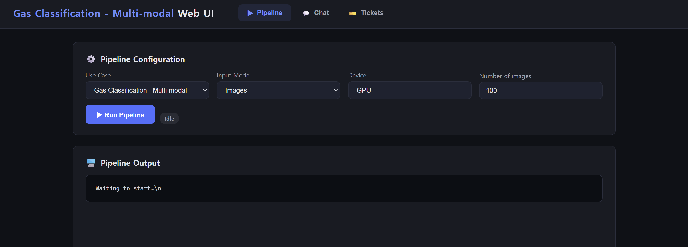
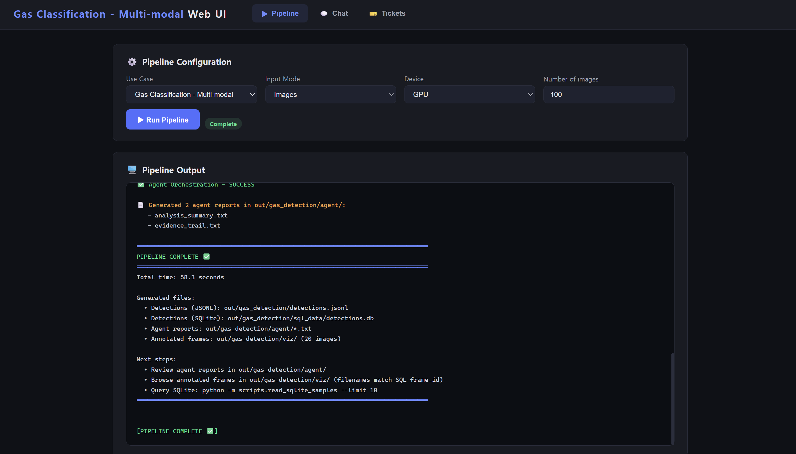
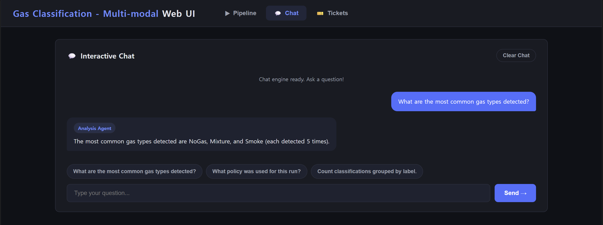
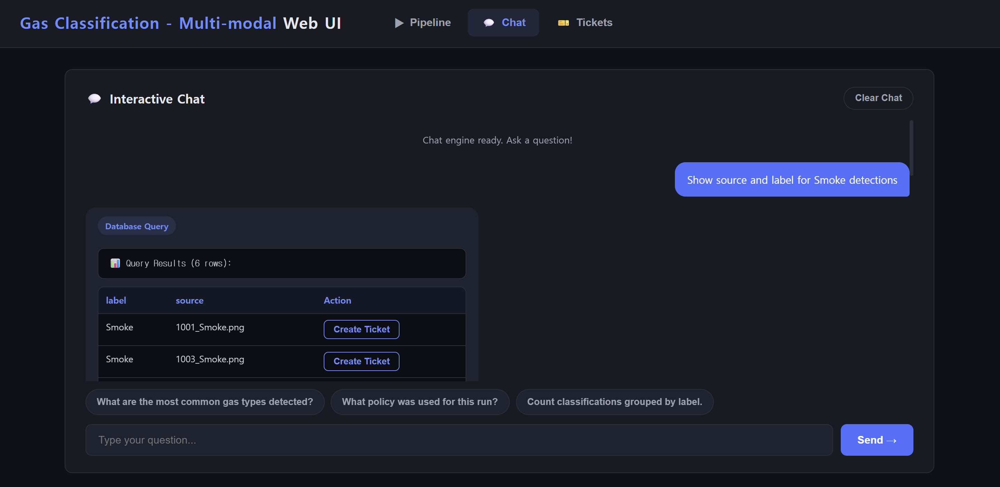
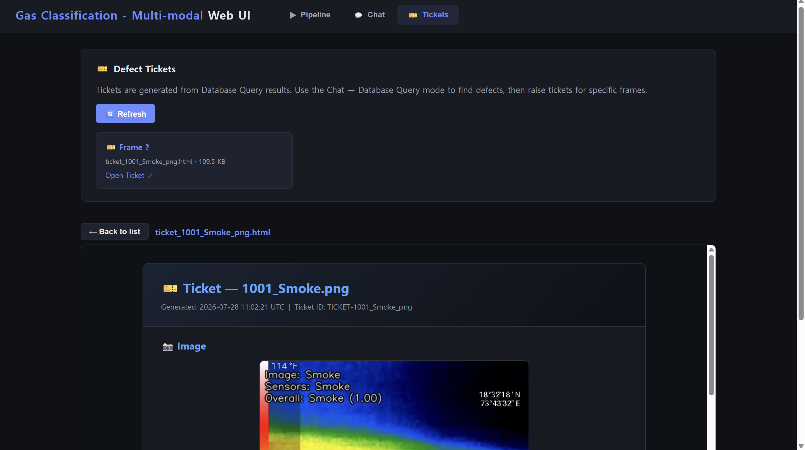
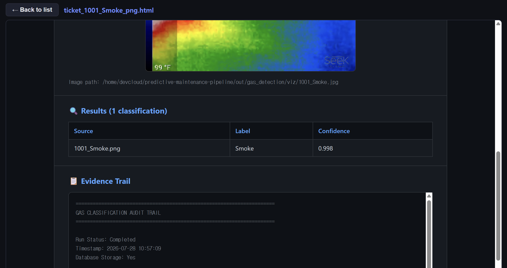

# Using the Web Interface

This guide walks through the browser-based interface for running the predictive
maintenance pipeline, querying agent outputs, running database questions, and
creating maintenance tickets.

## Launching the Web UI

```bash
conda activate pace
python scripts/launch_web_app.py start
```

The server starts at `http://localhost:5000`. Open this URL in your browser to
access the interface.

---

## Home Page



The home page is the central hub of the web interface. From here you can:

- **Run the Pipeline**: trigger the end-to-end inference and agent orchestration pipeline
- **Ask & Analyze**: ask natural-language questions over analysis, evidence, and SQL results
- **View Tickets**: browse and inspect generated maintenance tickets

---

## Running the Pipeline



Click the pipeline execution controls on the home page to start a run. The
interface streams progress to the browser in real time.

During a run, you can monitor:

- inference progress
- SQLite ingestion status
- agent orchestration phases
- generated artifact paths

When the pipeline finishes, the output artifacts are available for querying
through the chat interface and for ticket creation.

---

## Ask & Analyze



The **Ask & Analyze** section provides a unified chat interface. Type a question
or select a predefined question; the backend automatically routes the request to
the best available mode:

- `analysis` for report summaries and aggregate findings
- `evidence` for policy, traceability, and audit-trail questions
- `sql` for database queries over detection results

Each response is tagged with the detected mode, for example:

```text
[Detected: analysis]
```

If a use case disables an agent through `agents.active`, the router checks the
active modes before answering. This prevents the chat from trying to read missing
analysis or evidence artifacts.

### Example Questions

Analysis-style questions:

- "What are the most common defect types detected?"
- "Summarize the key findings from this run."
- "Show the confidence distribution by class."

Evidence-style questions:

- "What policy was used for this run?"
- "How many detections were kept after filtering?"
- "Where were the evidence artifacts stored?"

SQL-style questions:

- "Count detections grouped by label."
- "Show samples with confidence above 0.9."
- "Show source and label for Smoke detections."

For SQL questions, the interface displays the generated SQL query and formatted
results. If a result row includes an image or frame identifier, the row shows a
**Create Ticket** button.

### Clearing Chat

The **Clear Chat** button clears only the visible chat history in the browser. It
does not reset the backend state, loaded LLM, pipeline artifacts, database, or
generated tickets.

---

## Ticketing

### Creating Tickets During Analysis



While reviewing SQL query outputs, you can create tickets for specific image or
frame rows directly from the interface. Click **Create Ticket** to generate a
self-contained HTML ticket with the available detection image and metadata.

### Viewing Open Tickets



The **Tickets** section lists generated tickets. Each entry includes a link to
open the ticket artifact.

### Ticket Details



Each ticket is a self-contained HTML document that can include:

- the source image or frame
- predicted labels and confidence scores
- available metadata and detection coordinates
- the related evidence trail, when available

Tickets are portable HTML files. They can be opened without database access or a
running server, which makes them useful for offline review and maintenance
handoff.
